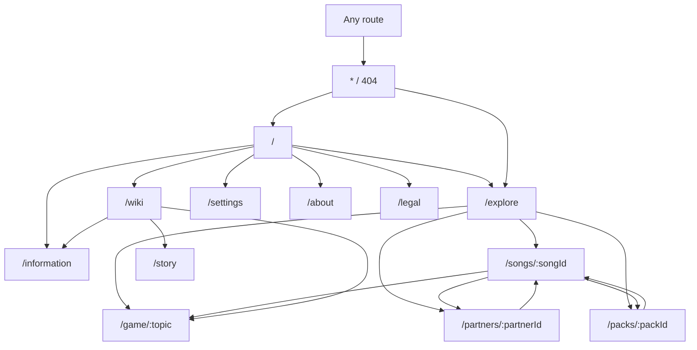
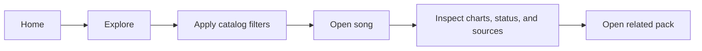
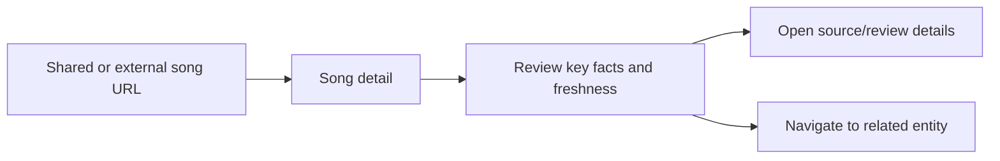
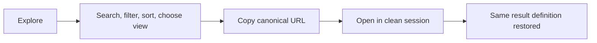
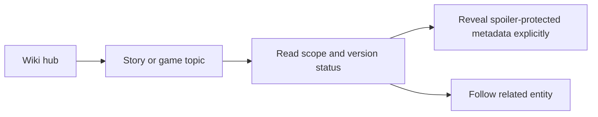
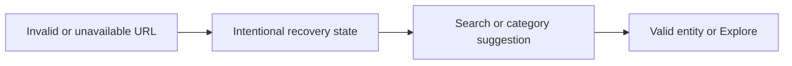
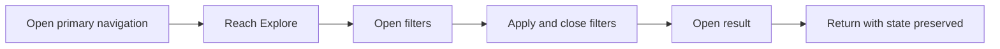

# Arcaea-Viewer Web MVP 0.1 Product Requirements

| Field | Decision |
| --- | --- |
| Status | Proposed for maintainer approval |
| Decision owner | Repository maintainer |
| Roadmap gate | Week 1 — product, data, legal, and UI discovery |
| Related issue | [#3 — Wiki-first PRD, MVP boundaries, sitemap, and user journeys](https://github.com/Dyu20705/arcaea-viewer/issues/3) |
| Pull request | [#84](https://github.com/Dyu20705/arcaea-viewer/pull/84) |
| Governing documents | [Project charter](PROJECT_CHARTER.md), [Web MVP brief](WEB_MVP_BRIEF.md), [six-week roadmap](../roadmap/WEB_MVP_ROADMAP.md) |
| Last substantive review | 2026-07-25 |

## 1. Executive decision

Arcaea-Viewer Web MVP 0.1 is a **static, public, source-aware fan wiki for ordinary Arcaea players**. Its primary value is reducing the time and uncertainty involved in discovering, looking up, and cross-referencing game information.

The public MVP will:

- present a coherent route structure for home, exploration, songs, packs, partners, story indexing, game topics, project information, legal information, settings, and recovery states;
- keep search, filters, sorting, result view, and pagination shareable through the URL;
- expose source, review, uncertainty, game-version, and catalog-freshness signals wherever the catalog can support them;
- remain useful without accounts, a hosted backend, analytics, copyrighted media, or the preserved Rust/WebAssembly runtime;
- use desktop as the initial density target without making keyboard, narrow-screen, zoom, reduced-motion, or missing-media behavior optional.

The existing Rust/WebAssembly parser, timing, renderer, and chart-preview work remains preserved and independently testable. It is not part of the public MVP navigation or product promise.

This document defines the product contract. It does not approve asset publication, settle legal interpretation, or prescribe the final catalog schema. Those decisions remain owned by issues [#11](https://github.com/Dyu20705/arcaea-viewer/issues/11), [#7](https://github.com/Dyu20705/arcaea-viewer/issues/7), and [#14](https://github.com/Dyu20705/arcaea-viewer/issues/14).

## 2. Problem statement

Arcaea information is distributed across official announcements, in-game presentation, community references, and player knowledge. A player may know the entity they want, may only know a filter such as difficulty or pack, or may need to understand a game system before they know what to search for.

The MVP addresses three product problems:

1. **Lookup cost:** direct facts and related entities should be reachable without navigating an unstructured article tree.
2. **Discovery cost:** browsing and filtering should be fast, reversible, and shareable.
3. **Trust cost:** the interface should distinguish reviewed, uncertain, stale, unavailable, and unsupported information instead of presenting all values as equally authoritative.

These are modeled product hypotheses derived from the accepted charter and brief. No external player interviews are claimed by this PR.

**UNKNOWN — REQUIRES VALIDATION:** post-preview user research should verify which filters, related-entity paths, and information categories create the greatest player value.

## 3. Product goals and success conditions

### 3.1 Goals

- Let a direct-lookup player reach an entity detail page from a URL or search result.
- Let a discovery-oriented player narrow a catalog and preserve the result definition in the URL.
- Let a knowledge-oriented player find story indexes, game topics, and update information without exposing copied story prose.
- Make provenance, review status, uncertainty, version applicability, and freshness visible enough to inform trust.
- Keep every public route representable by versioned static content or deterministic generated indexes.
- Define resilient states before frontend implementation begins.
- Keep the scope sustainable for one primary maintainer.

### 3.2 Non-telemetry success measures

The MVP does not introduce analytics merely to demonstrate product success. The initial gate is satisfied when:

- every primary journey in this document can be completed as a deterministic acceptance walkthrough;
- every supported explore state can be reconstructed from its canonical URL;
- every route maps to an explicit static entity, generated index, or repository-maintained editorial document;
- no runtime, upload, playback, analytics, replay, account, or backend surface appears in public navigation;
- every route has an intentional normal, unavailable, and recovery contract;
- every unresolved data, asset, legal, or freshness dependency is visible rather than silently invented.

## 4. Audience and behavioral personas

The primary audience is ordinary Arcaea players. Contributors and engineering reviewers are secondary audiences and must not distort the public information architecture.

### 4.1 Direct-lookup player

| Dimension | Contract |
| --- | --- |
| Trigger | The player has a song, pack, partner, chart, or game term in mind and wants a reliable answer quickly. |
| Primary task | Search or follow a direct link, inspect the requested entity, verify its status, and continue to a related entity when useful. |
| Required information | Canonical name, aliases where permitted, entity type, key metadata, relationships, game-version applicability, review status, and sources. |
| Failure condition | The player cannot distinguish “not found” from “not yet cataloged,” or cannot tell whether a visible value is reviewed, stale, or uncertain. |
| Trust signal | Source summary, reviewed-at date, applicable game version, catalog version, and explicit unknown/uncertain treatment. |
| Narrow-screen requirement | The primary facts and recovery action appear before secondary media or long related-entity lists. |

### 4.2 Discovery player

| Dimension | Contract |
| --- | --- |
| Trigger | The player knows a property or category, but not the exact entity they want. |
| Primary task | Search, filter, sort, compare, open a result, and return without losing the catalog definition. |
| Required information | Result count, active filters, sort order, compact comparison fields, missing-value treatment, and clear reset behavior. |
| Failure condition | Filters are hidden, irreversible, lost on refresh, or represented only in local component state. |
| Trust signal | Visible result definition, catalog version, stale-state notice, and per-result uncertainty indicators. |
| Narrow-screen requirement | Filters remain reachable without permanently displacing results; active filters and reset remain visible. |

### 4.3 Knowledge-oriented player

| Dimension | Contract |
| --- | --- |
| Trigger | The player wants to understand a story category, game system, terminology, release, event, or project status. |
| Primary task | Navigate through a category hub, read a concise maintainer-authored summary, inspect sources, and follow related entities. |
| Required information | Topic scope, version/date applicability, spoiler boundary, source status, related topics, and correction path. |
| Failure condition | The interface copies protected prose, exposes spoilers without warning, or presents old information as current. |
| Trust signal | Authorship/source distinction, spoiler label, reviewed-at date, and stale or disputed status. |
| Narrow-screen requirement | Heading hierarchy, disclosures, tables, and related links reflow without horizontal page scrolling. |

## 5. Product principles

1. **Player usefulness before portfolio display.** Architecture and presentation must reduce lookup, discovery, or trust cost.
2. **Trust is part of the interface.** Provenance and uncertainty are not footer-only metadata.
3. **Static-first and deterministic.** Public pages depend on reviewed versioned artifacts, not an unapproved network service.
4. **URL-owned discovery state.** Shareable catalog state is not hidden in React state or local storage.
5. **Original structure and presentation.** Existing products inform research; they do not supply copied layouts, prose, branding, or assets.
6. **Media is optional.** A missing or legally unavailable image cannot make a route unusable.
7. **Desktop-first is not desktop-only.** Keyboard, narrow-screen, text zoom, reduced motion, and touch behavior are product requirements.
8. **Unknown is a valid value.** Missing, disputed, unsupported, stale, or unreviewed data must remain distinguishable.

## 6. MVP scope

### 6.1 Included

- Project introduction and current catalog/release highlights.
- Searchable and filterable exploration across supported entity types.
- Song, pack, and partner detail surfaces.
- Story index and spoiler-aware story categorization without copied story text.
- Game-topic pages for approved systems and terminology.
- Information/wiki hubs, about, legal, settings, and recovery surfaces.
- Related-entity navigation.
- Source, review, uncertainty, version, and freshness presentation.
- Light, dark, and system theme preferences.
- Loading, empty, unavailable, stale, offline, error, missing-media, and not-found states.
- Static, versioned, schema-validated catalog artifacts and deterministic generated indexes, subject to issues #7 and #14.

### 6.2 Explicit exclusions

The MVP excludes:

- chart upload, AFF editing, chart playback, replay, deterministic analytics, and public renderer routes;
- audio previews or synchronization;
- accounts, authentication, profiles, favorites, comments, or application-hosted user-generated content;
- a production backend, database server, microservices, hosted search, or infrastructure added without a measured trigger;
- automatic scraping of third-party wikis;
- copied community-wiki prose, copied table presentation, official story text, official chart files, or proprietary game resources;
- redistribution of official artwork, song jackets, character art, logos, audio, screenshots, or other media without approved permission evidence;
- behavioral analytics or tracking by default;
- moderation tooling beyond repository contribution and correction workflows;
- complete localization;
- promises of complete or real-time game coverage.

### 6.3 Scope-cut order

If capacity slips, cut in this order while preserving the legal, trust, accessibility, and core lookup contract:

1. secondary homepage editorial modules;
2. card/table switching;
3. nonessential sort modes and secondary filters;
4. noncritical game-topic breadth;
5. decorative visual treatments;
6. optional offline enhancements beyond the last validated catalog snapshot.

Do not cut source status, legal notices, entity lookup, URL-owned filters, keyboard operation, not-found recovery, or missing-media behavior.

## 7. Information architecture

### 7.1 Content taxonomy

| Layer | Categories | Purpose |
| --- | --- | --- |
| Catalog entities | Songs, charts, packs, partners, story entries/indexes, game topics, releases/events | Facts and relationships represented by stable catalog records. |
| Generated discovery | Search index, filter facets, related-entity indexes, homepage highlights, category summaries | Deterministic view models derived at build time. |
| Editorial surfaces | Home introduction, wiki hub, information, about, legal | Maintainer-authored project and explanatory content. |
| Trust metadata | Sources, asset permission records, review status, uncertainty, applicable version/date, catalog version | Evidence and status needed to interpret published information. |
| User preference | Theme and approved display preferences | Local, non-account settings that do not replace canonical URL state. |

### 7.2 Sitemap

### 7.3 Navigation model

**Primary navigation**

- Home
- Explore
- Wiki
- Information

**Utility navigation**

- Search entry
- Theme/settings
- About
- Legal/corrections

Entity detail routes are reached through search, related links, or direct URLs. They are not required as top-level navigation items.

## 8. Route contract

| Route | Primary user task | Required content | Static dependency | URL-owned state | Required route states | Navigation placement |
| --- | --- | --- | --- | --- | --- | --- |
| `/` | Understand the project and enter a useful journey. | Unofficial status, project promise, search entry, reviewed highlights, catalog freshness, and links to primary categories. | Homepage view model plus editorial copy. | None. | Normal, stale catalog, partial/missing media, offline snapshot, unavailable highlights. | Primary. |
| `/explore` | Search, filter, sort, compare, and open catalog entities. | Query controls, result definition, result count, active filters, cards/table where approved, and recovery guidance. | Generated search/facet index. | Query, entity type, facets, sort, order, view, page. | Loading, results, empty, invalid parameters, stale, offline, index unavailable, error. | Primary. |
| `/songs/:songId` | Inspect a song and its chart/relationship metadata. | Identity, key metadata, charts, pack/partner/topic relationships, source/review status, and correction path. | Song record, chart records, related-entity view model. | Stable route ID only. | Normal, entity unavailable, unknown fields, stale, missing media, offline, not found. | Contextual/direct. |
| `/packs/:packId` | Understand a pack and browse its songs. | Pack identity, availability/status, song membership, release/version context, and sources. | Pack record plus generated song membership. | Stable route ID only. | Normal, empty membership, stale, missing media, offline, not found. | Contextual/direct. |
| `/partners/:partnerId` | Inspect a partner record and related content. | Identity, approved factual metadata, spoiler boundary, related songs/packs/story categories, and sources. | Partner record plus related-entity view model. | Stable route ID only. | Normal, spoiler-protected, uncertain, missing media, stale, offline, not found. | Contextual/direct. |
| `/story` | Browse story structure without reproducing protected story prose. | Story categories, ordering/version context, spoiler controls, concise original summaries where legally approved, and related entities. | Story index; individual content scope remains constrained by #11/#14. | Optional noncanonical section anchor only. | Normal, spoiler-protected, unavailable category, stale, offline. | Wiki hub. |
| `/game/:topic` | Understand an approved game system or term. | Topic summary, version applicability, related entities/topics, sources, and correction path. | Game-topic record and related index. | Stable route ID only. | Normal, stale, disputed/uncertain, offline, not found. | Wiki hub/contextual. |
| `/information` | Review releases, events, catalog freshness, and project notices. | Dated entries, applicable version/date, source status, and stale handling. | Release/event records plus editorial notices. | Optional approved category filter; no hidden state. | Normal, empty, stale, offline, unavailable. | Primary. |
| `/wiki` | Enter the content taxonomy. | Category cards/lists, scope descriptions, status counts, and links to story/game/information categories. | Generated category index. | None. | Normal, empty category, partial catalog, offline. | Primary. |
| `/about` | Understand the project and its limitations. | Mission, unofficial status, maintenance model, contribution link, and current limitations. | Repository-maintained editorial document. | None. | Normal. | Utility/footer. |
| `/legal` | Understand publication boundaries and request a correction or takedown. | Disclaimer, source/asset policy summary, correction path, private contact path, and attribution where required. | Repository-maintained legal/provenance policy. | None. | Normal; contact-unavailable fallback must be explicit. | Utility/footer. |
| `/settings` | Change local display preferences. | Light/dark/system theme and any later approved local preferences; storage failure explanation. | Local preference contract. | None; URL state takes precedence for route-specific display state. | Normal, storage unavailable, reset confirmation. | Utility/header. |
| `*` | Recover from an invalid or removed URL. | Attempted path summary without unsafe reflection, search entry, home/explore links, and support diagnostics where safe. | App shell only. | Attempted URL is diagnostic context, not a filter contract. | 404, malformed direct link, unsupported legacy link. | Recovery only. |

### 8.1 Route-specific clarifications

- `/wiki` is a taxonomy hub; `/information` is the dated release/event/project-status surface; `/about` explains the project itself.
- `/story` is an index and navigation surface in MVP. Publishing full story text, translations, screenshots, or copied summaries is excluded unless issue #11 establishes a lawful and reviewable path.
- `/explore` is the only route whose sorting and filtering contract is defined in this PRD.
- Entity IDs and exact catalog fields are not invented here. Issues #7 and #14 must define stable identifiers and schemas compatible with this route contract.
- Current or live-looking information must carry an applicable date/version and freshness status. The static MVP must not imply real-time completeness.

## 9. Explore URL-state contract

### 9.1 Supported parameters

| Parameter | Cardinality | Meaning | Default and canonical behavior |
| --- | --- | --- | --- |
| `q` | Zero or one | Human-entered search text. | Trim surrounding whitespace; omit when empty. Exact length and normalization limits are owned by #14. |
| `type` | Zero or one | Catalog entity type to search. Values come from the approved catalog taxonomy. | Omit for all searchable types. Invalid values are ignored and surfaced as a recoverable parameter notice. |
| `pack` | Zero or more | Stable pack IDs used as facets. | Repeat the parameter for multiple values. Deduplicate and sort values in the canonical URL. |
| `difficulty` | Zero or more | Stable difficulty IDs defined by catalog data. | Repeat for multiple values. Do not hardcode a closed list in the router. |
| `levelMin` | Zero or one | Inclusive lower level bound. | Omit when unset. Invalid or reversed ranges are rejected with an actionable control-level message. |
| `levelMax` | Zero or one | Inclusive upper level bound. | Omit when unset. |
| `sort` | Zero or one | Approved result sort key: `relevance`, `title`, `level`, or `release`. | `relevance` when `q` is present; otherwise `title`. Omit the effective default. |
| `order` | Zero or one | `asc` or `desc`. | Use the sort-specific default and omit it when unchanged. |
| `view` | Zero or one | `cards` or `table`. | URL overrides the local display preference; omit when using the configured default. |
| `page` | Zero or one | One-based result page. | Omit for page 1. Reset to page 1 when the result definition changes. |

### 9.2 Canonicalization and history

- The URL is the source of truth for search, facets, sorting, result view, and page.
- Controls initialize from the URL on direct navigation, reload, back/forward navigation, and shared links.
- A meaningful committed filter/search change creates a history entry; purely intermediate text-entry changes may replace the current entry until committed.
- Default values, empty values, duplicates, and unsupported values are removed from the canonical URL.
- Repeated facet values are deduplicated and serialized deterministically.
- Unknown parameters not owned by the application are preserved only when a documented integration requires them; otherwise they are ignored without crashing.
- Invalid application-owned values produce a nonblocking explanation and a canonical corrected URL.
- Local storage may provide a default `view` or theme, but never overrides an explicit URL value.
- No personal, secret, proprietary, or account-derived information may be placed in the URL.

## 10. Trust, content, and publication contract

Every public factual surface must be able to expose, directly or through an accessible disclosure:

- the applicable game version or effective date when known;
- the catalog snapshot/version;
- review status and reviewed-at date;
- source references at the appropriate fact-group granularity;
- uncertainty, dispute, unsupported-version, or missing-value status;
- asset availability and alt-text status where media is present;
- a correction path.

The interface must distinguish:

| Status | Meaning | User-facing behavior |
| --- | --- | --- |
| Reviewed | Evidence and applicability were checked under the approved policy. | Normal presentation with source/review access. |
| Unreviewed | Record exists but has not passed required human review. | Do not publish as ordinary factual content. |
| Unknown | The value is not known from approved evidence. | Show “Unknown”; do not infer or substitute. |
| Uncertain | Evidence exists but is incomplete or conflicting. | Show the uncertainty and source conflict. |
| Stale | The record was reviewed for an older version/date. | Keep visible only with a prominent stale status when still useful. |
| Unavailable | The product intentionally cannot publish the content or asset. | Explain the category of limitation without exposing sensitive evidence. |
| Unsupported | The catalog/application cannot interpret the record or version. | Show recovery guidance and support diagnostics. |

Issue #11 remains authoritative for legal/provenance policy. In particular:

- community references may help locate facts but do not authorize copying their prose, layout, database expression, or media;
- official game assets, logos, audio, story text, charts, screenshots, and promotional media are not included by default;
- neutral placeholders are the default when asset permission is absent or uncertain;
- this PRD is a product decision, not a legal opinion.

## 11. Cross-cutting state model

| State | Required message | Required action | Prohibited behavior |
| --- | --- | --- | --- |
| Loading | What is loading and whether existing content remains usable. | Allow cancellation/navigation where practical. | Indefinite unlabeled spinner or layout collapse. |
| Empty | The active result definition and why zero content is shown. | Clear/reset filters or navigate to a broader category. | Treating empty as an application error. |
| Entity unavailable | The entity is known but not publishable, not reviewed, or unavailable in this snapshot. | Return to explore or related category. | Fabricating placeholder facts. |
| Error | A concise failure class and safe recovery path. | Retry, return, or copy safe diagnostics. | Exposing stack traces, private paths, or raw payloads. |
| Offline | Whether the app shell or a previously validated catalog snapshot is available. | Continue with cached content or retry online. | Implying cached content is current. |
| Stale snapshot | Snapshot version/date and the effect on visible content. | Continue knowingly or check information/status. | Hiding freshness because the page still renders. |
| Unsupported/corrupt catalog | Version/validation failure and rollback/recovery action. | Reload a supported snapshot or report the issue. | Partially rendering unvalidated facts as normal. |
| Missing media | Neutral reserved frame and meaningful text alternative where appropriate. | Continue using the factual page. | Broken-image layout, copied substitute, or decorative alt text. |
| Spoiler-protected | Scope of concealed information without revealing it. | Explicit reveal with persistent focus and reversible state. | Hover-only reveal or spoiler text in accessible names before consent. |
| Not found | The requested route/entity was not resolved. | Search, explore, or return home. | Redirecting silently to an unrelated entity. |

State priority is:

1. unsupported or corrupt catalog;
2. route/entity not found or unavailable;
3. offline/stale snapshot;
4. partial data or missing media;
5. normal content.

## 12. Primary user journeys

### 12.1 Browse to a song and related pack

Acceptance:

- active filters, sort, view, and page are visible in the explore URL;
- the song page displays relationship and trust status without requiring media;
- back navigation restores the same explore definition;
- the pack relation uses a stable entity link.

### 12.2 Direct entity lookup

Acceptance:

- direct navigation does not require a prior app session;
- an invalid ID produces a recoverable not-found state;
- the page never substitutes a similarly named entity silently.

### 12.3 Share a discovery state

Acceptance:

- canonical state is reconstructed without local storage;
- defaults and duplicates do not pollute the URL;
- invalid values are explained and corrected safely.

### 12.4 Browse knowledge content with spoiler control

Acceptance:

- story structure remains useful without copied story prose;
- concealed content is not exposed by hover, focus, or accessible name before explicit reveal;
- stale or uncertain information is visible.

### 12.5 Recover from missing or unavailable content

Acceptance:

- the failure class is distinguishable from an empty catalog query;
- recovery does not expose unsafe diagnostics;
- the user can reach home or explore with keyboard alone.

### 12.6 Narrow-screen and keyboard journey

Acceptance:

- focus order follows visual and semantic order;
- primary controls remain operable at 320 CSS px and 200% text zoom;
- no required action depends on hover or motion;
- opening/closing navigation or filters returns focus predictably.

## 13. Accessibility and responsive product requirements

- Use semantic landmarks, a logical heading hierarchy, visible focus, and a skip link.
- All primary journeys must work by keyboard without character-key shortcuts.
- No focused component may be completely obscured by sticky or overlay content.
- Text and controls must remain usable at 200% text zoom and a 320 CSS px viewport without two-dimensional page scrolling.
- Primary controls should target at least 44 by 44 CSS px where layout permits; no pointer target may violate the WCAG 2.2 minimum contract.
- Reduced-motion preference disables nonessential transitions and transforms.
- Color is never the only carrier of difficulty, status, uncertainty, error, or selection.
- Cards, tables, disclosures, and filter controls require explicit narrow-screen transformations.
- Missing media must preserve layout and meaning.
- Accessibility exceptions require explicit maintainer approval and a follow-up issue.

Detailed visual/component requirements are owned by issue #4 and implemented by the Week 2 design-system and shell issues.

## 14. Route-to-data dependency matrix

This matrix defines required product capabilities, not final schema names.

| Product surface | Minimum product view | Required relationships | Owner of final contract |
| --- | --- | --- | --- |
| Home | Catalog/version summary, reviewed highlights, dated information entries. | Highlight to entity; information entry to sources. | #7 and #14 |
| Explore | Searchable entity projection, facets, sort fields, result status. | Result to canonical entity; facet value to stable ID. | #7 and #14 |
| Song | Song identity plus chart projections and trust metadata. | Song to charts, pack, partners/topics where approved, sources. | #14 |
| Pack | Pack identity and generated song membership. | Pack to songs, releases, sources. | #14 |
| Partner | Partner identity and approved relationship projection. | Partner to songs/packs/story categories/sources where verified. | #14 and #11 |
| Story | Story index metadata and spoiler/status fields. | Story category to related entities and sources. | #14 and #11 |
| Game topic | Maintainer-authored summary plus version/source status. | Topic to entities, related topics, sources. | #14 and #11 |
| Information | Dated release/event/project entries. | Entry to sources and applicable version/date. | #14 and #11 |
| Legal/About | Repository-maintained editorial content. | Legal policy to correction/private-contact path. | #11 |
| Settings | Local preference state. | No catalog relationship. | Week 2 shell/design system |

**UNKNOWN — REQUIRES VALIDATION BY #7/#14**

- expected catalog size and whether result pagination or domain splitting is required;
- exact stable-ID syntax;
- exact searchable fields and language normalization;
- final difficulty/level value domains;
- catalog version compatibility and stale threshold;
- which current release/event information can be maintained reliably as static data.

## 15. Acceptance scenarios

| ID | Given | When | Then |
| --- | --- | --- | --- |
| PRD-01 | A clean session and the homepage | The visitor follows the primary navigation | Home, Explore, Wiki, and Information are discoverable; runtime/viewer routes are absent. |
| PRD-02 | An explore URL with supported query and facets | The page loads or reloads | Controls and result definition match the URL. |
| PRD-03 | A configured local card/table preference | An explicit `view` parameter is present | The URL value wins for that route state. |
| PRD-04 | Duplicate/default/invalid query parameters | The route canonicalizes state | Defaults and duplicates are removed; invalid values do not crash and receive an explanation. |
| PRD-05 | A valid song ID | The visitor opens the route directly | Key facts, charts, relationships, status, and sources are available without a prior session. |
| PRD-06 | An unknown entity ID | The visitor opens the route directly | A distinct not-found state offers search, explore, and home recovery. |
| PRD-07 | A record with unknown or conflicting values | The detail page renders | Unknown/uncertain status is visible; no value is inferred. |
| PRD-08 | An entity with no approved image | The page renders | A reserved neutral media state is shown and factual content remains usable. |
| PRD-09 | A stale but validated catalog snapshot | The visitor uses the site | Snapshot freshness is visible and the site does not imply current completeness. |
| PRD-10 | A keyboard-only visitor at narrow width | The visitor completes the explore-to-detail journey | Navigation, filters, result opening, return state, and recovery remain operable. |
| PRD-11 | Reduced motion is requested | The visitor operates navigation, filters, and disclosures | No essential information or action depends on animation. |
| PRD-12 | A story category contains spoiler-sensitive or legally unavailable detail | The visitor opens `/story` | Structure and status remain useful without automatically exposing spoilers or protected prose. |

## 16. Decisions and rejected alternatives

| Decision | Accepted approach | Rejected alternative | Reason |
| --- | --- | --- | --- |
| Public product focus | Wiki-first information product. | Viewer/runtime-first navigation. | The accepted charter and brief prioritize ordinary-player lookup and discovery; runtime work is preserved for post-MVP review. |
| Delivery model | Versioned static catalog and build-time indexes. | Production backend or database in MVP. | No measured requirement justifies service cost, privacy surface, or operational burden. |
| Discovery state | Query parameters with deterministic canonicalization. | Path-encoded filters or component-only state. | URLs must be shareable, reloadable, and compatible with browser history. |
| Information architecture | Task-oriented home/explore/detail/wiki/information split. | Copying an existing wiki or game-database hierarchy. | The project requires an original structure and has different legal, trust, and maintenance constraints. |
| Story scope | Spoiler-aware index and approved original summaries only. | Reproducing story text or community-wiki prose. | Publication permission and legal path are unresolved. |
| Media | Optional, permission-gated media with neutral fallback. | Media-dependent cards or copied placeholders. | Missing permission must not block usability or create an incentive to redistribute assets. |
| Success evidence | Deterministic acceptance walkthroughs and release evidence. | Adding analytics solely to measure MVP usage. | Privacy and operational cost are not justified before public product fit is established. |
| Invalid URLs | Explain, canonicalize, and recover. | Silent fallback to arbitrary defaults or redirects. | Silent correction hides errors and can misrepresent the requested entity/state. |

## 17. Risks, dependencies, and decision ownership

| Risk or unknown | Impact | Owner / dependency | Required resolution |
| --- | --- | --- | --- |
| lowiro derivative-work policy and the legal basis for an Arcaea-related software/wiki remain unresolved. | Public release, naming, visual direction, and content publication may be blocked or require changes. | Maintainer and #11. | Record explicit legal/provenance decision before public release; omit disputed content/assets meanwhile. |
| Source and asset permission policy is not yet approved. | Detail pages may expose unreviewed facts or unavailable media. | #11. | Define source hierarchy, permission evidence, disclaimer, correction/takedown path, and forbidden content. |
| Stable IDs, schemas, indexes, and catalog compatibility are not yet approved. | Routes and URL facets cannot be implemented safely. | #7 and #14. | Adopt contracts that satisfy this PRD without leaking a backend into the MVP. |
| Current release/event freshness is operationally expensive. | `/` and `/information` could imply stale current information. | #14 and content workflow. | Define review dates, stale threshold, update ownership, and an honest unavailable state. |
| No direct player interviews were completed for this PRD. | Filter priority and content hierarchy may be incorrect. | Maintainer/post-preview research. | Validate through structured walkthroughs and public-preview feedback; do not fabricate research evidence. |
| Desktop-first density may harm narrow-screen and zoom use. | Core journeys could fail accessibility requirements. | #4, Week 2 shell/design system, Week 5 audit. | Approve responsive transformations and test at the stated acceptance widths. |

## 18. Post-MVP path

After the static wiki MVP is stable and legally reviewable, expansion may proceed in this order:

1. broader, versioned community-maintained content;
2. richer search, cross-linking, and content history;
3. localization;
4. optional hosted search/data services only after measured static limits;
5. chart viewer and deterministic analytics surfaces;
6. local-first replay and personal analysis;
7. progression, recommendation, lore graph, and research features.

Each expansion requires a separate product, legal, privacy, security, performance, and maintenance decision.

## 19. Approval record

Issue #3 remains `status:human-required`. Before merge, the maintainer must explicitly approve:

- the primary audience and modeled personas;
- the route and navigation contract;
- the distinction among `/wiki`, `/information`, `/about`, and `/story`;
- the explore URL-state contract;
- the MVP exclusions and scope-cut order;
- the story/media/legal constraints and recorded unknowns;
- the acceptance scenarios and dependencies unlocked for issues #7, #5, and #4.

Approval must be recorded in GitHub. AI-authored text or a passing CI run is not maintainer approval.
